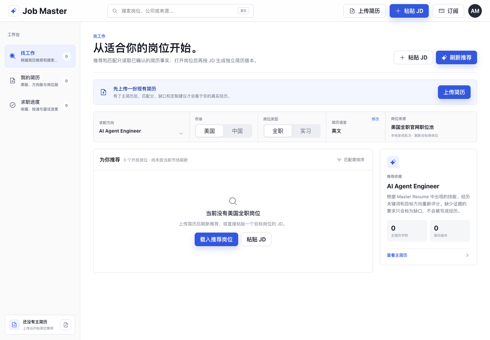

# Job Master

#### 一个以 Resume Application Agent Skill 为核心的本地求职工作台

中文 · [English](./README.en.md)


Job Master 把一个可安装的求职 Skill 和一个本地可视化工作台放在同一仓库里。

- **Skill**：读取岗位 JD，从候选人确认过的事实库中选择证据，生成定制简历重点、申请回答和结构化填表数据。
- **网站**：管理 Master Resume、方向简历、岗位版简历、岗位发现和申请进度，并逐条审核 AI 或手动修改。

它不是自动海投工具。默认仍是手动官网流程；可选自动化只处理一个具体岗位、一个冻结申请包和一次执行。候选人必须先审核官网实际字段，再对精确公司与岗位进行第二次授权。授权 10 分钟后失效，页面、字段、简历或来源凭据变化都会使授权失效；工作授权、签证赞助、EEOC、薪资、附件和 CAPTCHA 等内容仍由候选人本人处理。

## Dashboard 预览



Dashboard 默认从“找工作”开始。上传真实 Master Resume 后，可以按市场、全职 / 实习和求职方向刷新岗位，并在同一工作台进入简历定制与申请跟踪。

## 30 秒快速开始

### 1. 安装 Skill

推荐保留完整仓库，并把它链接到 Codex 的 Skill 目录。这样 Dashboard、脚本和 Skill 会保持在同一个版本：

```bash
git clone https://github.com/Akw0od/job-master.git
cd job-master
mkdir -p ~/.codex/skills
ln -s "$(pwd)" ~/.codex/skills/resume-application-agent
```

如果不想使用符号链接，也可以复制安装；执行前请确认目标目录不存在：

```bash
cp -R . ~/.codex/skills/resume-application-agent
```

重启 Codex 后，可以直接说：

```text
使用 resume-application-agent，读取这个 JD 并基于我确认过的简历事实生成申请包。
```

也可以在支持仓库安装的 Agent 中直接提供地址：

```text
请安装并使用这个求职 Skill：https://github.com/Akw0od/job-master
```

### 2. 打开 Dashboard

要求 Node.js 20+。使用 AI 简历改写（由本机代理转交 Codex CLI 配置的模型）或手动触发官网岗位搜索时，需要已安装并登录的 Codex CLI。可选官网表单自动化还需要本机安装 Google Chrome。

```bash
npm install
npm run dev
```

命令会同时启动 Dashboard 和 localhost-only 本机代理服务。打开终端显示的 Vite 地址，通常是 `http://127.0.0.1:5173/`；若端口被占用，Vite 会自动选择下一个可用端口。本机代理固定监听 `http://127.0.0.1:4317`。

只查看界面、不启用 AI 改写：

```bash
npm run dev:web
```

## 当前能力

### 本地网站

- 上传可搜索的 PDF、DOCX 或 TXT，并立即建立只读 Master Resume。
- 本地提取 PDF 文本层和 DOCX 语义结构，保留页眉原始顺序、章节顺序、段落分组及跨行项目符号，并显示解析检查结果。
- 派生可复用方向简历和一次性岗位版简历，始终保留来源链路。
- 在“成品预览 / 原文对照”之间切换；对照模式在正文中标红原句，在右侧完整展示绿色改写，并用编号联动定位。
- 每处 AI 改写必须明确接受或拒绝后才能保存派生版本；刷新页面后继续保留版本、审核结果和来源链路。
- 每次 AI 改写在发送前都会展示精确数据清单。请求仅包含所选完整简历、可选完整 JD、市场、语言、目标岗位和用户指令；完整简历可能含姓名、邮箱、电话等个人信息，这些内容会随简历正文发送。不额外发送申请辅助中的本地档案字段、申请追踪、其他岗位或全部浏览器存储。选择“记住”只在本浏览器保存授权版本和时间，且可在“本地数据”中撤销。
- 通过浏览器原生打印导出 A4 或 Letter PDF，保留可选择文字和系统中文字体；最终保存位置由用户在打印窗口确认。
- 手动新增、删除或改写派生简历内容；Master Resume 保持不可变。
- 按美国 / 中国与全职 / 实习独立筛选岗位；没有可验证岗位时显示真实空态。
- 点击“刷新推荐”后，由 localhost-only Agent 搜索官网具体职位页并执行链接核验；切换筛选只读取本地缓存，不会隐式联网。
- 官网搜索不发送 Master Resume 或候选人个人信息；搜索结果回到浏览器后才根据 Master Resume 和自定义方向本地评分。
- 粘贴 JD 时原样保存完整岗位快照；岗位版改写请求同时携带该 JD，不再用公司名或职位名代替岗位要求。
- 信号分是 0–100 的本地排序信号，不是录取概率、资格判断或 ATS 分数；它展示目标方向、简历关键词、已确认事实和自定义方向的实际贡献，并区分证据充分、关键词匹配、有限匹配和待评估。
- 英文技术词按词边界匹配（例如 `AI` 不会从 `email` 推断出来），中文词可安全包含匹配；算法版本变化时旧信号分与派生依据会清空为“待刷新”，不会继续展示旧结果。
- 追踪收藏、准备中、已投递、面试、Offer、未通过和归档等候选人视角状态。
- 只有用户收藏、开始定制或打开申请页后，岗位才进入求职进度；发现列表不再被误算成申请记录。
- 在“今天”视图按面试、到期跟进、岗位核验、岗位版简历和申请审核生成最多五项可执行任务；跟进只生成并复制模板，不会发送邮件。
- 在“面试”视图记录时间、阶段、准备和复盘笔记，并只从已提交简历与当前岗位证据生成练习提纲；在“转化数据”中查看发现、投递、面试和 Offer 的观察值，小样本会明确标注。
- 浏览器本地答案库只复用候选人亲自确认的非敏感答案；工作授权、签证、身份和薪资答案不会保存。
- 每次打开具体岗位申请链接前，按该岗位和该简历版本重新核对本地字段包；只允许复制用户逐项授权的联系方式、明确教育章节和明确经历/项目章节到系统剪贴板。
- 默认手动模式不会自动填表或提交。对 Greenhouse、Ashby、Lever 和可安全识别的公司官网，可选“填写后停下”或“审核后提交一次”：专用 Chrome 会扫描实际字段，候选人逐项审核后再对精确岗位授权。任何 CAPTCHA、页面变化、必填缺口、附件、敏感字段或提交控件歧义都会停止执行。
- 自动提交只有在官网返回可验证的成功页或确认信息后才记录为“已投递”；浏览器本地审计历史只保留 ID、结果码和指纹，不保留联系方式、简历、JD、答案或 URL。
- 手动官网投递也不能直接改成“已投递”：需要选择实际使用的已保存岗位版简历、实际投递时间，以及成功页、确认邮件、ATS 账户记录或确认编号之一。系统只保存证据类型和记录指纹；旧投递记录可以在岗位工作台补录。

网站目前是 **local-first 原型**：简历正文和操作状态以带版本迁移的浏览器本地草稿为主，不声称使用 SQLite 或云端数据库。仓库内置岗位全部标记为“待重新核验”；只有用户点击刷新后、本地 Agent 搜索并通过具体链接检查的结果才显示为“链接已核验”。这仍不是持续运行的招聘聚合服务。

AI 改写请求会先经过 `localhost-only` 本机代理，再由 Codex CLI 交给当前配置的模型处理；本机代理不是本地模型推理。模型处理地点与数据保留策略由所选模型提供方决定；本机临时文件会在请求结束后删除。官网岗位搜索始终不发送简历。

### Resume Application Agent Skill

- 将 JD 分类为 `sde`、`risk_engineer`、`fde` 或 `ai_agent_engineer` 等岗位 archetype。
- 从 `data/profile_context.md` 中选择与 JD 最相关的已确认经历。
- 生成 `application_packet.md`、`autofill_data.json` 和 `packet_data.json`。
- 遇到履历缺口时明确标记，不编造公司、日期、学历、技能或指标。
- 浏览器填表最多停在 final review screen，未经当前岗位的明确批准不得提交。

## Dashboard 详细说明

`npm run dev` 会同时启动：

- Vite 网站：终端显示的 `http://127.0.0.1:517x/`
- 本地 Agent：`http://127.0.0.1:4317`

只运行前端：

```bash
npm run dev:web
```

完整工程检查：

```bash
npm run check
```

## 使用 Skill 生成申请包

公开仓库中的 `data/profile_context.md` 只包含示例资料。实际使用前，请先替换为本人确认过的简历事实。

```bash
python scripts/resume_agent.py \
  --jd examples/amazon_sde_jd.txt \
  --role "Amazon SDE" \
  --out runs/amazon-sde
```

输出：

```text
runs/amazon-sde/
|-- application_packet.md
|-- autofill_data.json
`-- packet_data.json
```

## 仓库结构

```text
.
|-- SKILL.md                    # Agent Skill 入口与安全规则
|-- data/                       # 岗位 archetype 与公开示例事实库
|-- examples/                   # 示例 JD
|-- scripts/
|   |-- resume_agent.py         # 确定性申请包生成器
|   `-- dev.mjs                 # 网站与本地 Agent 联合启动器
|-- local-agent/                # Codex CLI 本地改写服务
|-- src/                        # React 求职工作台
|-- test/                       # 前端领域与本地 Agent 测试
|-- templates/                  # 申请包模板
|-- tests/                      # Python Skill 测试
`-- AGENTS.md                   # 原型的产品与实现约束
```

## 安全与隐私

1. **事实由用户拥有。** 未确认内容不能伪装成简历事实。
2. **Master Resume 不可变。** AI 和手动修改都必须生成派生版本并提供差异审核。
3. **不得后台或批量提交。** 自动提交只允许一个具体公司与岗位、一个已审核冻结申请包、10 分钟内的一次执行；任何变化都必须重新审核和授权。
4. **敏感字段不得猜测。** 工作授权、签证、残障、退伍军人、种族和性别等问题必须由本人回答。
5. **本地不等于零风险。** 使用真实简历前应检查设备权限、浏览器存储和所调用模型的隐私政策。

## 测试

```bash
npm run check
```

Python 测试覆盖岗位分类、证据选择、文件输出和人工提交门；前端构建用于验证本地工作台可发布。

## 项目总结

Job Master 目前有两个互补入口：Agent 通过 [SKILL.md](./SKILL.md) 执行确定性的 JD 分析和申请包工作流，用户通过 Dashboard 管理简历版本、岗位发现和投递状态。两者共享同一组事实边界和人工确认规则。

当前版本已经能完整演示“上传 Master Resume -> 准备方向简历 -> 发现岗位 -> 按 JD 定制 -> 打开官方申请 -> 跟踪状态”的核心闭环。它仍是 local-first 原型，适合个人试用、Skill 验证和产品迭代，不应被描述为已经具备生产级账户、实时岗位聚合或云端数据保障的 SaaS。

## TODO

### P0：完成核心闭环

- [ ] 用真实桌面数据库替代浏览器本地草稿，并提供迁移与导出。
- [ ] 接入可验证的实时岗位来源，持续检查具体职位链接是否仍然有效。
- [x] 保留可搜索 PDF / DOCX 的页眉、章节、段落和项目符号结构，并提供 A4 / Letter 可选择文字的 PDF 打印导出。
- [ ] 继续提升复杂双栏、表格、图标和扫描件的原版视觉还原；当前版本不会对无文本层扫描件伪造解析结果。
- [ ] 使用专门测试账号完成更多真实提供方的“岗位详情 -> 定制简历 -> 官方站申请辅助 -> 确认回填”外部端到端验证；当前自动化由本地安全门和隔离测试覆盖，不声称已覆盖所有招聘站。
- [ ] 为 Skill 增加可重复的安装、升级、卸载和版本检查流程。

### P1：走向可用 SaaS

- [ ] 增加用户账户、远程数据库、权限隔离和可删除的数据生命周期。
- [ ] 接通 Stripe webhook、订阅权益和服务端权限校验；保持未获批支付方式不可见。
- [ ] 增加敏感字段保护、审计日志、错误恢复和生产级隐私说明。
- [ ] 建立岗位匹配、简历改写和申请辅助的质量评估集。

### P2：发布与生态

- [ ] 提供可复现的演示数据、产品截图和短视频。
- [ ] 增加更多岗位方向，但保持内置方向稳定并允许用户自定义。
- [ ] 完善贡献指南、版本发布和 Skill 分发渠道。

## License

[MIT](./LICENSE)
